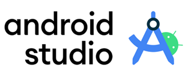
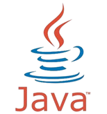
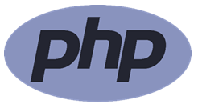
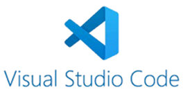
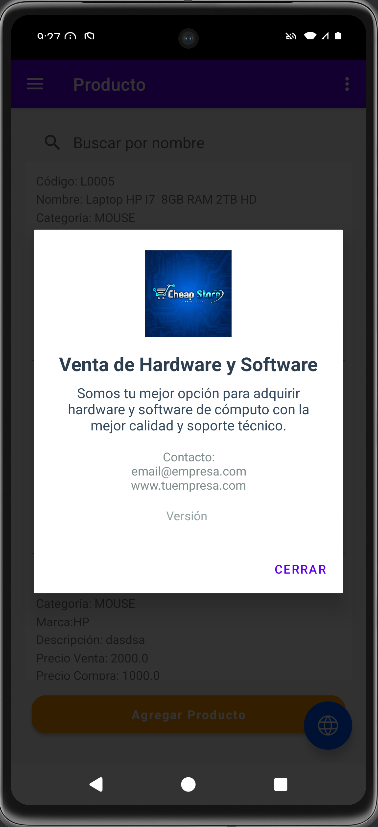
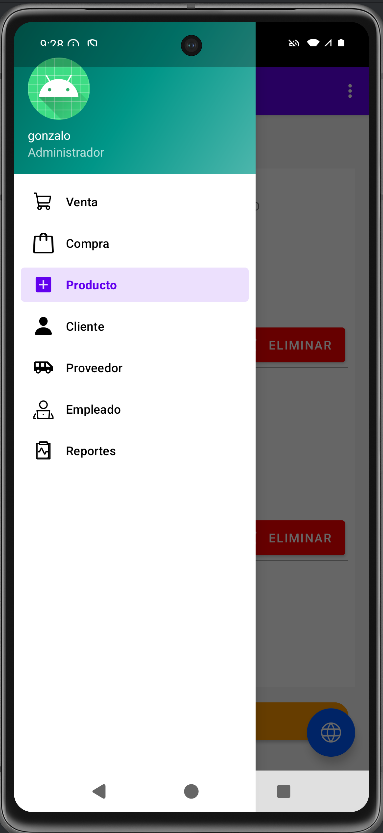

  

# 📱 Aplicación Móvil para el Proceso de Gestión de Almacén en la Empresa Cheap Store

Aplicación móvil desarrollada con Android Studio. Este proyecto tiene como objetivo para mejorar el control del inventario en la empresa Cheap Store, permitiendo una gestión eficiente y en tiempo real de las entradas y salidas de productos.

## 🚀 Tecnologías Utilizadas
<table align="center">
  <tr>
    <td align="center">
       
      <strong>Android Studio</strong>
    </td>
    <td align="center">
       
      <strong></strong>
    </td>
    <td align="center">
       
      <strong>MySQL / MariaDB</strong>
    </td>
    <td align="center">
       
      <strong></strong>
    </td>
    <td align="center">
       
      <strong></strong>
    </td>
    <td align="center">
       
      <strong>Wamp Server</strong>
    </td>
  </tr>
</table>

## 📦 Archivos de Descarga

- [📁 Descargar Archivos PHP](https://github.com/ZeroTwoMiu/Aplicacion_CheapStore/raw/master/Complementos/cheapstore.rar)
- [🗄️ Descargar Base de Datos (.sql)](https://github.com/ZeroTwoMiu/Aplicacion_CheapStore/raw/master/Complementos/SQLcheapstore.rar)

## 📸 Capturas de Pantalla

  
  

## 📄 Licencia

Este proyecto está bajo la Licencia MIT.  
Puedes usarlo, modificarlo o distribuirlo libremente, siempre y cuando mantengas el aviso de derechos de autor original.

Consulta el archivo [LICENSE](LICENSE) para más detalles.
